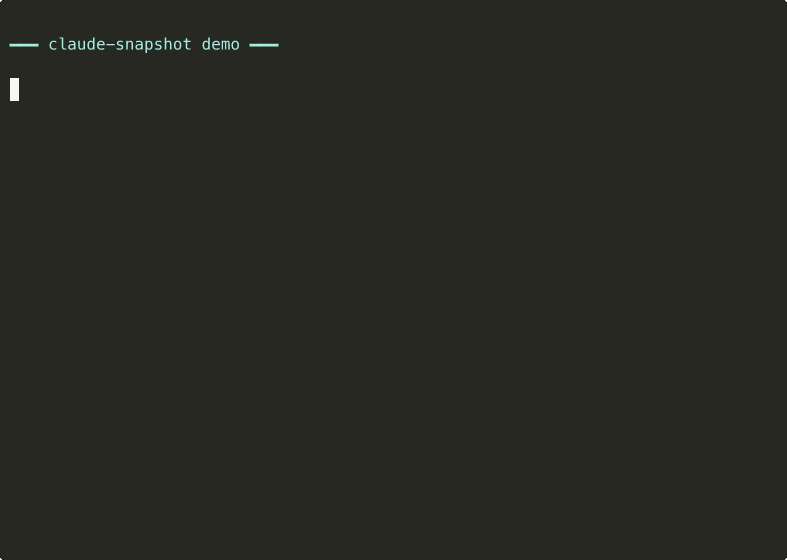
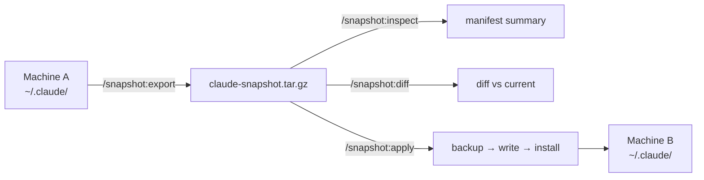

<div align="center">

# claude-snapshot

**Portable Claude Code setup snapshots.** Export your config, plugins, hooks, and global instructions — apply on another machine in under 2 minutes.

[](https://opensource.org/licenses/MIT)
[](https://docs.anthropic.com/en/docs/claude-code)
[](https://nodejs.org/)



</div>

## Why

- **Multiple machines** — Keep your personal and work setups in sync. Export at home, drop the file on Drive, apply at work.
- **Mac format / OS reinstall** — Save a snapshot before wiping your machine. Restore your entire Claude Code setup after a fresh install.
- **Safe rollback** — About to experiment with new plugins or risky config changes? Take a snapshot first. If things break, apply the snapshot and you're back to a known good state.
- **Onboarding** — New team member? Share your team's snapshot and they're up and running with the same plugins, hooks, and conventions.

## Principles

Design decisions in this plugin are evaluated against these principles.

**[P1] Minimal Blast Radius**: one-shot commands, no daemon, no background watch, no network. Every side effect is triggered by an explicit user command and scoped to `~/.claude/` plus the output tarball path.

**[P2] Allowlist Over Denylist**: snapshots contain an explicit list of artifacts (settings, `CLAUDE.md`, hooks, plugin manifests, MCP servers). New files Claude Code adds in future versions are NOT auto-captured — plugin updates decide what gets included. This is the opposite trade-off from wholesale-capture tools; we pay with manual maintenance and gain predictable, auditable snapshot contents.

**[P3] No Network, Ever**: export and apply are local-only. Plugin reinstallation during apply delegates to Claude Code's own `/plugin install` mechanism, which manages network access itself. claude-snapshot makes zero outbound requests.

**[P4] Diff Before Destroy**: every `apply` is preceded by a diff summary the user must acknowledge. Every overwritten file is first copied to `<file>.bak`. Snapshot contents are always inspectable without extraction via `/snapshot:inspect`.

**[P5] Cross-Platform First-Class**: the plugin is Node.js, not bash. It runs the same on macOS and Linux without polyfills, different code paths, or GNU-coreutils assumptions. Windows via WSL is supported; native Windows is best-effort.

## Prior art

| Project | What it does | claude-snapshot adds |
|---|---|---|
| [`claude-code-dotfiles`](https://github.com/elizabethfuentes12/claude-code-dotfiles) | Git wrapper around `~/.claude/` | Structured manifest, `diff`, `inspect`, automated plugin reinstall |
| `.claude` dotfiles repos (various) | Copy-paste setup templates | Automated export/apply instead of manual curation |
| `claude-code-sync` (npm) | Session & usage tracking | Focuses on *configuration*, not session history |
| `claude-code-config` (npm) | Proxy / permission switcher | Full setup capture, not just permissions |

## Prerequisites

- Claude Code with plugin support
- Node.js 18+ (the plugin uses the [`tar`](https://www.npmjs.com/package/tar) npm package for archive I/O)

## Install

```bash
# 1. Register the marketplace
/plugin marketplace add adhenawer/claude-snapshot

# 2. Install the plugin
/plugin install snapshot@claude-snapshot

# 3. Reload plugins
/reload-plugins
```

## Commands

| Command | Description |
|---|---|
| `/snapshot:export` | Export your setup as a portable `.tar.gz` snapshot |
| `/snapshot:export --full` | Include plugin caches for offline restore |
| `/snapshot:export --output <path>` | Custom output path |
| `/snapshot:inspect <path>` | Preview snapshot contents without extracting |
| `/snapshot:diff <path>` | Compare a snapshot against your current setup |
| `/snapshot:apply <path>` | Apply a snapshot to this machine (with confirmation) |

## Typical workflows

### Sync between machines

```bash
# On your personal machine
/snapshot:export --output ~/Drive/claude-snapshot.tar.gz

# On your work machine
/snapshot:apply ~/Drive/claude-snapshot.tar.gz
```

### Backup before format

```bash
# Before wiping
/snapshot:export --full --output ~/Desktop/claude-backup.tar.gz

# After fresh install + Claude Code installed
/snapshot:apply ~/Desktop/claude-backup.tar.gz
```

### Safe experimentation

```bash
# Save current state
/snapshot:export --output ~/claude-before-experiment.tar.gz

# Try new plugins, change hooks, break things...

# Something went wrong? Roll back
/snapshot:apply ~/claude-before-experiment.tar.gz
```

## What migrates

| Artifact | Included |
|---|---|
| `settings.json` (plugins, hooks, permissions, env, statusLine) | Yes |
| `CLAUDE.md` + other global `.md` files | Yes |
| Plugin manifests + marketplace registrations | Yes |
| Hook scripts | Yes |
| MCP servers (from `~/.claude.json`, `mcpServers` key only — OAuth tokens excluded) | Yes (report only on apply) |
| Plugin caches (with `--full`) | Yes |
| Sessions, history, telemetry | No |
| Project-scoped plugins | No |

## How it works



1. **Export** reads `~/.claude/` and writes a `.tar.gz` with a `manifest.json` index.
2. Absolute paths (like `/Users/you/`) are normalized to `$HOME` for portability.
3. **Apply** extracts the snapshot, resolves `$HOME` for the target machine, backs up any conflicting files as `.bak`, and installs missing plugins via `claude plugin install`.
4. **MCP servers** are captured from `~/.claude.json` (the `mcpServers` key only) and included in the tarball. On apply, claude-snapshot *reports* which MCPs need installation on the target machine — it does NOT auto-write `~/.claude.json` because that file also holds OAuth tokens and project state.

### Snapshot anatomy

```
claude-snapshot-YYYY-MM-DD.tar.gz
├── manifest.json           # schemaVersion, plugins, marketplaces, hooks, MDs, MCPs, checksums
├── settings.json           # your Claude Code settings
├── mcp-servers.json        # MCP server configs (only if you have any; path-normalized)
├── global-md/              # CLAUDE.md and other root-level .md files
├── hooks/                  # your custom hook scripts
├── plugins/
│   ├── installed_plugins.json
│   ├── known_marketplaces.json
│   └── blocklist.json
└── cache/                  # (only with --full)
```

## Privacy

claude-snapshot is designed with reversibility and minimal blast radius in mind.

**What it touches**

- Reads `~/.claude/` on export
- Writes files into `~/.claude/` on apply — with automatic `.bak` backup of any conflicting file
- Writes the output tarball to the path you specify (default: `~/`)

**What it doesn't touch**

- No writes outside `~/.claude/` and your chosen output path
- No network requests — plugin install during apply delegates to Claude Code's own `/plugin install` mechanism
- No telemetry, no analytics, nothing leaves your machine
- Does not require `--dangerously-skip-permissions`

**Reversibility**

Every file overwritten during `apply` is copied to `<file>.bak` first. If something breaks, restore from the `.bak` files or re-apply the previous snapshot.

## Uninstall

```bash
# Remove the plugin
/plugin uninstall snapshot

# (Optional) Remove the marketplace registration
/plugin marketplace remove claude-snapshot
```

Snapshots you created (`*.tar.gz`) are plain files — delete them as you would any other file.

## Contributing

Issues and PRs welcome at [github.com/adhenawer/claude-snapshot/issues](https://github.com/adhenawer/claude-snapshot/issues). For larger changes, please open an issue first to discuss the approach.

## License

[MIT](LICENSE)
